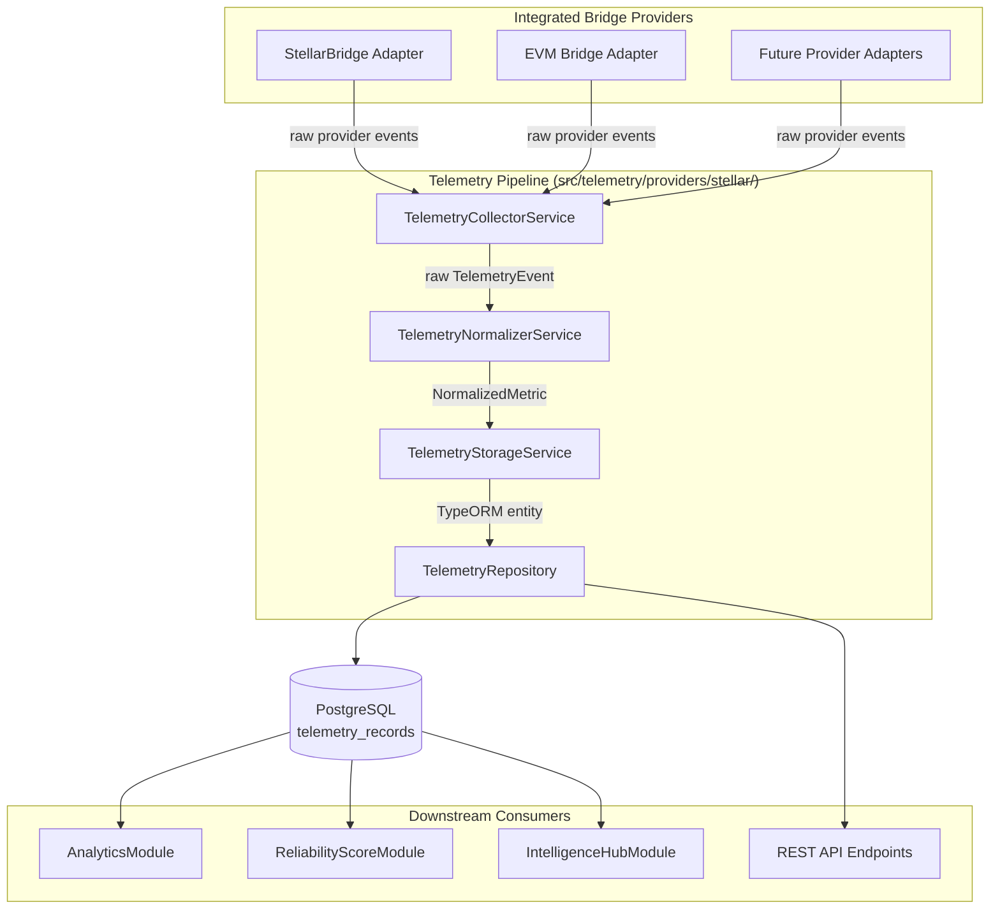
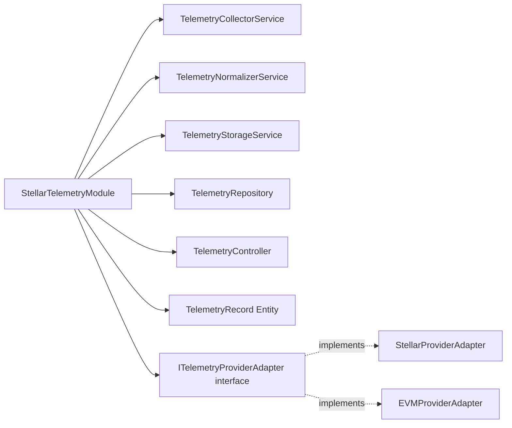
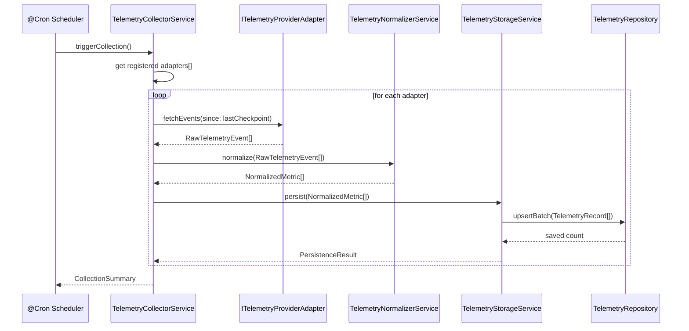
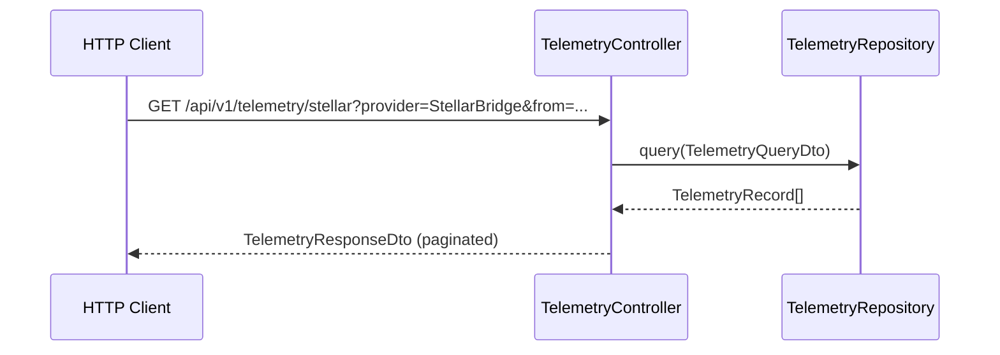

# Design Document: Stellar Telemetry Collection

## Overview

The Stellar Telemetry Collection feature introduces a dedicated, structured pipeline for collecting, normalising, and persisting operational telemetry from Stellar-integrated bridge providers. Currently, provider metrics are scattered across multiple modules (`analytics`, `bridge-compare`, `reliability-score`, `intelligence-hub`) with no unified collection path, making it difficult to reason about cross-provider health in real time. This feature adds a `src/telemetry/providers/stellar/` module that acts as the single source of truth for raw provider telemetry: it pulls events from each registered provider adapter, normalises them into a canonical metric schema, and stores the records in a dedicated persistence layer. Downstream modules can then consume clean, structured telemetry rather than re-deriving metrics from disparate sources.

## Architecture

### System-Level Context



### Module Decomposition



## Sequence Diagrams

### Telemetry Collection Flow (Scheduled Poll)



### On-Demand Query Flow



## Components and Interfaces

### Component 1: ITelemetryProviderAdapter

**Purpose**: Defines the contract every provider adapter must fulfil to participate in the telemetry pipeline. New providers are onboarded by implementing this interface and registering with the collector.

**Interface**:
```typescript
export interface ITelemetryProviderAdapter {
  /** Unique provider identifier, e.g. "StellarBridge" */
  readonly providerId: string;
  /** Provider network type */
  readonly providerType: 'stellar' | 'evm';

  /**
   * Fetch raw telemetry events from the provider since a given checkpoint.
   * Must be idempotent – repeated calls with the same checkpoint return the
   * same events.
   */
  fetchEvents(since: Date): Promise<RawTelemetryEvent[]>;

  /**
   * Returns true when the adapter is able to reach the provider endpoint.
   * Used for health-check skipping during outages.
   */
  isAvailable(): Promise<boolean>;
}
```

**Responsibilities**:
- Communicate with the external/internal provider data source
- Return raw, un-normalised events bounded by the `since` timestamp
- Report availability so the collector can skip gracefully during outages

### Component 2: TelemetryCollectorService

**Purpose**: Orchestrates the end-to-end collection cycle. Iterates registered adapters, invokes fetch, delegates normalisation, then delegates persistence. Tracks per-adapter checkpoints to avoid duplicate ingestion.

**Interface**:
```typescript
export interface ITelemetryCollectorService {
  /** Register an adapter for inclusion in collection cycles */
  registerAdapter(adapter: ITelemetryProviderAdapter): void;
  /** Trigger a full collection pass across all registered adapters */
  collectAll(): Promise<CollectionSummary>;
  /** Collect from a single named provider */
  collectFromProvider(providerId: string): Promise<ProviderCollectionResult>;
}
```

**Responsibilities**:
- Maintain a map of `providerId → ITelemetryProviderAdapter`
- Persist and advance per-adapter `lastCheckpoint` timestamps
- Fan-out collection concurrently with `Promise.allSettled`
- Log and surface per-adapter errors without aborting the full cycle

### Component 3: TelemetryNormalizerService

**Purpose**: Translates provider-specific `RawTelemetryEvent` payloads into the canonical `NormalizedMetric` structure. Applies field mapping, unit conversions, and validation.

**Interface**:
```typescript
export interface ITelemetryNormalizerService {
  normalize(events: RawTelemetryEvent[]): NormalizedMetric[];
  normalizeOne(event: RawTelemetryEvent): NormalizedMetric | null;
}
```

**Responsibilities**:
- Map provider-specific field names to canonical schema fields
- Convert fee amounts to a unified USD-denominated decimal
- Validate required fields; drop and log malformed events
- Attach `normalizedAt` timestamp and `schemaVersion` to each metric

### Component 4: TelemetryStorageService

**Purpose**: Accepts normalised metrics and writes them to PostgreSQL via the repository. Handles batching and duplicate detection.

**Interface**:
```typescript
export interface ITelemetryStorageService {
  persist(metrics: NormalizedMetric[]): Promise<PersistenceResult>;
  getLatestCheckpoint(providerId: string): Promise<Date | null>;
}
```

**Responsibilities**:
- Convert `NormalizedMetric` to `TelemetryRecord` TypeORM entity
- Use upsert (on-conflict update) keyed on `(providerId, eventId)` to be idempotent
- Return counts of inserted vs. updated records

### Component 5: TelemetryRepository

**Purpose**: TypeORM-backed data access layer for `TelemetryRecord` entities. Provides typed query methods consumed by both the storage service and REST controller.

**Interface**:
```typescript
export interface ITelemetryRepository {
  upsertBatch(records: TelemetryRecord[]): Promise<number>;
  findByQuery(query: TelemetryQueryDto): Promise<[TelemetryRecord[], number]>;
  findLatestCheckpoint(providerId: string): Promise<Date | null>;
  deleteOlderThan(cutoff: Date): Promise<number>;
}
```

### Component 6: TelemetryController

**Purpose**: Exposes read-only REST endpoints for querying stored telemetry records. Follows the existing `/api/v1/` prefix convention used across the codebase.

**Interface**:
```typescript
@Controller('api/v1/telemetry/stellar')
export class TelemetryController {
  @Get()                         getRecords(@Query() q: TelemetryQueryDto): Promise<TelemetryResponseDto>
  @Get('metrics/aggregated')     getAggregated(@Query() q: TelemetryQueryDto): Promise<AggregatedTelemetryDto>
  @Get('providers')              listProviders(): Promise<ProviderSummaryDto[]>
  @Get('health')                 getCollectionHealth(): Promise<CollectionHealthDto>
}
```
